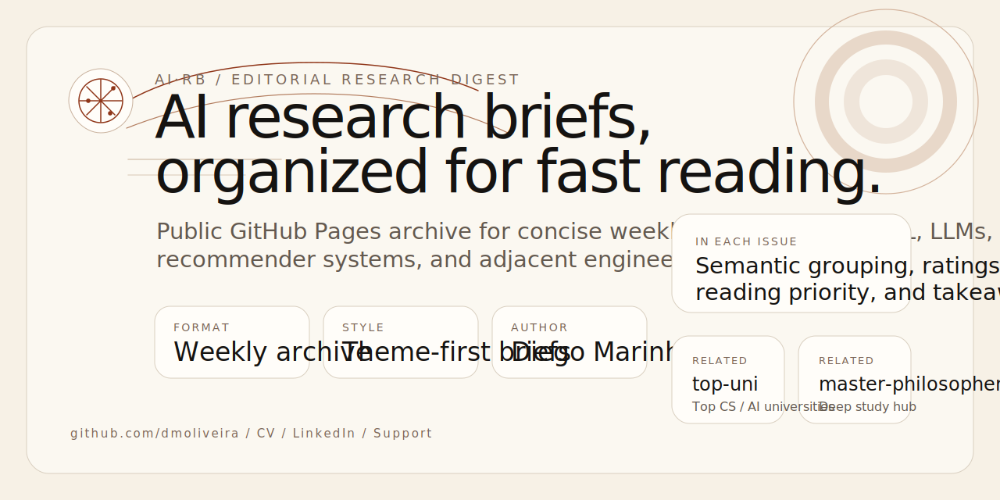

# ai-research-briefs



[](https://dmoliveira.github.io/ai-research-briefs/)
[](https://dmoliveira.github.io/ai-research-briefs/rss.xml)
[](https://github.com/dmoliveira/ai-research-briefs/actions/workflows/publish.yml)
[](LICENSE)
[](https://dmoliveira.github.io/my-cv-public/cv/human/)
[](https://buy.stripe.com/8x200i8bSgVe3Vl3g8bfO00)

Public GitHub Pages archive for concise AI research digests.

## ✦ What This Is

`ai-research-briefs` publishes dated, skimmable research briefs covering:

- AI / ML
- LLMs
- AI agents
- recommender systems
- adjacent computer science and applied engineering research

Each issue is designed to be fast to scan, easy to archive, and stable enough for automation.

## ⏱ Publishing Rhythm

- Monday, Wednesday, and Friday
- concise, theme-grouped issues
- public archive with RSS output
- quality-first selection over filler volume

## 🔎 What Each Brief Includes

- 10-20 important papers, journals, or technical articles when quality supports that count
- semantic grouping by theme instead of one long flat list
- concise summaries in plain language
- relevance and quality ratings
- estimated reading time
- key results, conclusions, and a practical take
- explicit caveats when freshness, review status, or evidence is weak

## 🌐 Live Site

- Site: [dmoliveira.github.io/ai-research-briefs](https://dmoliveira.github.io/ai-research-briefs/)
- RSS: [dmoliveira.github.io/ai-research-briefs/rss.xml](https://dmoliveira.github.io/ai-research-briefs/rss.xml)
- Latest brief: [2026-05-16 issue](https://dmoliveira.github.io/ai-research-briefs/2026/05/2026-05-16.html)

## 🧭 Repository Layout

```text
docs/
  _config.yml
  _layouts/default.html
  _includes/
  assets/
  tags/
  index.md
  rss.xml
  YYYY/MM/YYYY-MM-DD.md
scripts/
  generate_index.py
  rss.py
.github/workflows/
  publish.yml
automation-prompt.md
```

## ⚙️ How It Works

1. A digest is written to `docs/YYYY/MM/YYYY-MM-DD.md`.
2. `scripts/generate_index.py` rebuilds the homepage archive.
3. `scripts/rss.py` rebuilds the feed.
4. GitHub Actions publishes `docs/` through GitHub Pages.

## 🗂 Site Structure

The site is organized as a dashboard-editorial archive:

- a top-level research homepage
- a latest-brief feature surface
- featured papers from the newest issue
- theme exploration cards
- a recent-briefs ledger
- full brief pages with summary, trends, ranked reads, and structured paper cards

## 🧠 Automation Shape

The Codex automation for this repository should:

1. search credible sources from the previous 7 days
2. select only strong, non-duplicate items
3. write the dated digest file
4. regenerate the homepage index
5. regenerate RSS
6. commit and push only if the result is meaningful

The current Codex prompt is stored in [automation-prompt.md](automation-prompt.md).

## 🧪 Local Commands

Generate the homepage index:

```bash
python3 scripts/generate_index.py
```

Generate RSS:

```bash
python3 scripts/rss.py
```

Serve the site locally:

```bash
python3 -m http.server 8000 -d docs
```

## 👤 Author

- GitHub: [Diego Marinho](https://github.com/dmoliveira)
- CV: [dmoliveira.github.io/my-cv-public/cv/human](https://dmoliveira.github.io/my-cv-public/cv/human/)
- LinkedIn: [linkedin.com/in/dmztheone](https://www.linkedin.com/in/dmztheone/)

## 🪄 Related Projects

- [top-uni](https://dmoliveira.github.io/top-uni/): top 200 universities for computer science, AI/ML, and data science
- [ai-loop](https://dmoliveira.github.io/ailoop/): operational loop for AI work, execution rhythm, and system-level iteration

These helped set the tone for:

- quiet but high-signal presentation
- GitHub Pages-first publishing
- editorial structure with public archival value
- support-friendly open project framing

## 💛 Support

If this project is useful, support helps keep the archive public and maintained:

- Stripe support: [buy.stripe.com/8x200i8bSgVe3Vl3g8bfO00](https://buy.stripe.com/8x200i8bSgVe3Vl3g8bfO00)
- You can also share the site, star the repo, or reference the briefs in your own reading workflow

## 📄 License

MIT.
